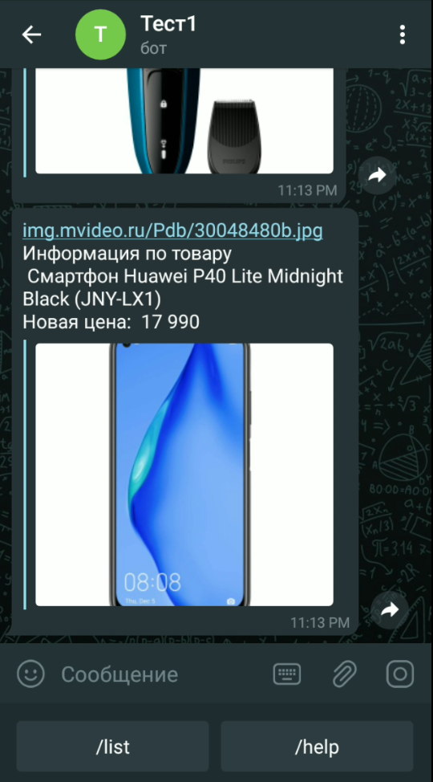

# ParsBot

Python telegram-bot for tracking price on listed goods from different marketplaces

## Requirements
1. requests ~= 2.30.0
1. beautifulsoup4 ~= 4.10.0
1. telebot ~= 4.15.0

## Usage

With pre-configured tg-bot run ```bot.py```

```bash
    python -m bot
```

## Workflow

* Send to the bot link of goods you want to track
* Use command ```/list``` to display them
* Click on inline-button to get current information about your position
* *Bot regulary parsing your postions and if the price decrease, you will get notification* 

